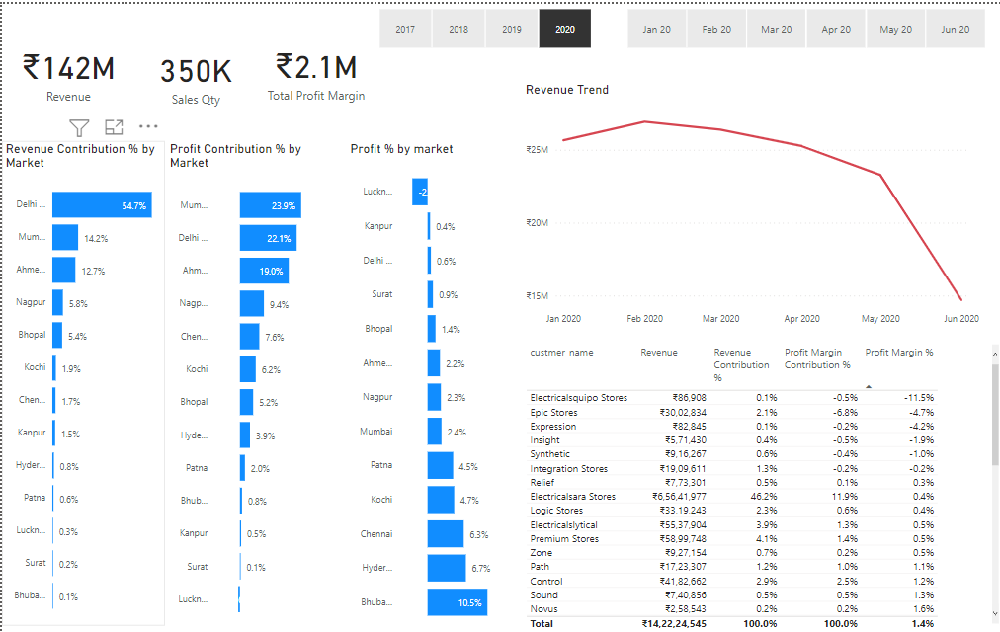
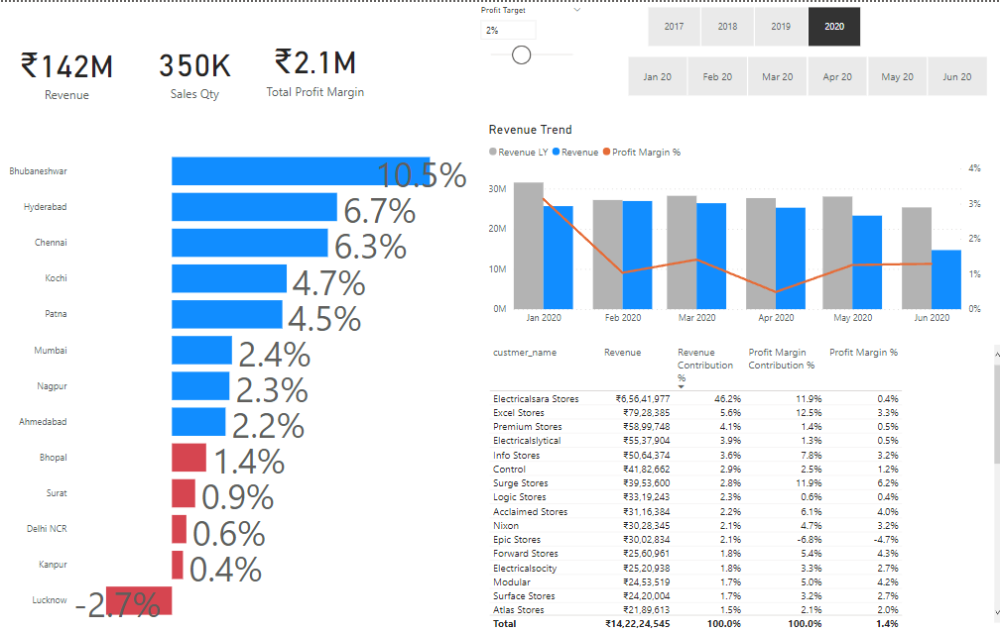
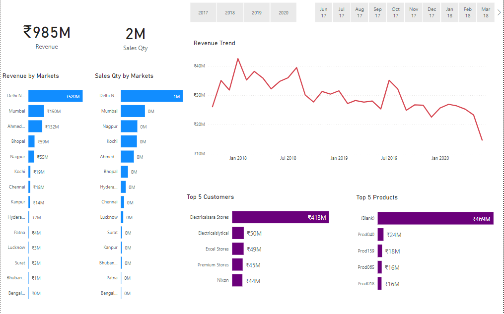

# Sales Insights for consumer electronics Dashboard

Built a sales insights solution for AtliQ Hardware that helped bring data informed decision making in the organization cutting their operation cost by 40k$ in first 6 months after the launch

Jupyter Notebook was written in Python that connected with MySQL to get required sales data to perform exploratory data analysis (EDA)

Data cleaning and transformation was done using numpy and pandas. For data visualization Seaborn python module was used

This insights solution helped business get answers for common questions such as top 5 customers, top 5 products, sales, and expense trends etc.

## Profit Analysis

## Performance Insights

## Key Insights

